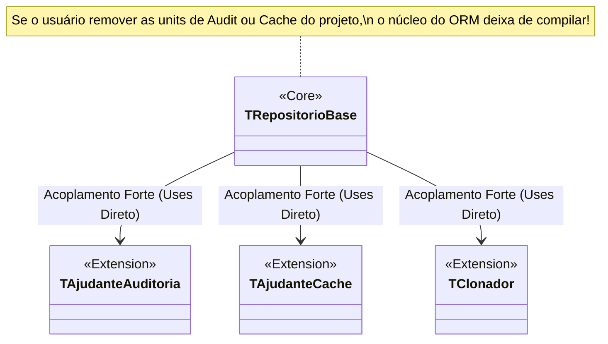

# Análise de Acoplamento e Coesão — MinusFramework

Este documento apresenta uma análise técnica profunda sobre o **acoplamento** (coupling) e a **coesão** (cohesion) do código-fonte do **MinusFramework**, identificando pontos fortes do design atual e vazamentos estruturais (design leaks) que necessitam de refatoração para garantir a extensibilidade do ORM.

---

## 1. Análise de Coesão (Cohesion)

De forma geral, o MinusFramework apresenta **alta coesão**. A maioria das classes e módulos possui responsabilidades muito bem delimitadas e focadas em uma única área de atuação.

### ✅ Pontos Fortes (Alta Coesão)
* **[TCacheMetadados](file:///C:/Users/Gabriel/OneDrive/Documentos/MinusFrameWork/Source/Core/MF.MetadataCache.pas#L58):** Extremamente coeso. Sua única finalidade é ler via RTTI as anotações das classes de entidade, compilar as strings de comando SQL estáticas correspondentes (Select, Insert, Update, Delete) e armazená-las de forma thread-safe na inicialização.
* **[TConstrutorSelecao](file:///C:/Users/Gabriel/OneDrive/Documentos/MinusFrameWork/Source/Core/MF.SelectBuilder.pas#L23):** Coesão funcional excelente. Tem a única responsabilidade de construir e executar de forma fluente instruções SQL SELECT, abstraindo a Criteria API e a paginação.
* **[TRastreadorMudancas](file:///C:/Users/Gabriel/OneDrive/Documentos/MinusFrameWork/Source/Core/MF.ChangeTracker.pas#L21):** Focado puramente em gerar snapshots de valores antigos de propriedades e calcular deltas de alteração (dirty tracking) para as entidades.

### ⚠️ Oportunidades de Melhoria (Coesão Local)
* **Procedimentos Soltos no `implementation` de [MF.UnitOfWork.pas](file:///C:/Users/Gabriel/OneDrive/Documentos/MinusFrameWork/Source/Core/MF.UnitOfWork.pas):**
  Funções como `DefinirIdEntidade`, `VincularIdChave`, `ExecutarInsercaoComRetorno`, `ExecutarInsercaoSemRetorno` e `ExecutarExclusao` estão declaradas como rotinas livres na seção de implementação da unit.
  * *Problema:* Embora isso mantenha a interface da classe `TUnidadeTrabalho` limpa, move regras pesadas de geração e persistência SQL física diretamente para o arquivo que deveria ser responsável *apenas* por gerenciar transações e registrar estados das entidades.
  * *Solução:* Mover essas rotinas utilitárias de execução SQL física para um executor dedicado (ex: `TComandoPersistencia` ou em helpers de mapeamento).

---

## 2. Análise de Acoplamento (Coupling)

O acoplamento é o ponto mais crítico da arquitetura atual. Embora o framework implemente o padrão de pipeline/hooks para desacoplar as extensões do núcleo, existem **vazamentos estruturais de acoplamento forte** que impedem o funcionamento modular do ORM.

### ✅ Pontos Fortes (Desacoplamento por Pipeline)
* A unit [MF.Extensao.Core.pas](file:///C:/Users/Gabriel/OneDrive/Documentos/MinusFrameWork/Source/Core/MF.Extensao.Core.pas) define uma infraestrutura fantástica de hooks baseada em interfaces (`IProcessadorInsercao`, `IProcessadorAtualizacao`, `IProcessadorExclusao`).
* O singleton `TRegistroProcessadores` funciona como uma central de despacho, permitindo que as units de auditoria ([MF.Extensions.Audit.pas](file:///C:/Users/Gabriel/OneDrive/Documentos/MinusFrameWork/Source/Extensions/MF.Extensions.Audit.pas#L282-L286)) e cache se registrem de forma transparente durante a inicialização (bloco `initialization`), sem que o núcleo conheça a implementação física delas.

### ❌ Pontos Críticos (Acoplamento Forte e Vazamento de Dependências)



#### A) Acoplamento Físico de Extensões na cláusula `uses` do Núcleo
Na seção `implementation` da unit core [MF.RepositoryBase.pas](file:///C:/Users/Gabriel/OneDrive/Documentos/MinusFrameWork/Source/Core/MF.RepositoryBase.pas#L116-L121), encontramos dependências diretas de implementações do diretório `/Extensions`:
```pascal
uses
  MF.Extensions.Cache,
  MF.Extensions.Audit,
  MF.Extensions.Relacionamento,
  MF.Extensions.Bulk,
  ...
```
* **Consequência:** Isso viola a modularidade. Se o desenvolvedor desejar compilar uma versão lightweight do ORM sem suporte a cache de segundo nível ou auditoria, ele **não consegue**, pois o compilador do Delphi exige a presença dessas units físicas do diretório de extensões para compilar a unit do repositório básico.

#### B) O "Vazamento" de Assinatura no Pipeline de Exclusão (TObject vs ID)
No método [TRepositorioBase\<T>.Excluir](file:///C:/Users/Gabriel/OneDrive/Documentos/MinusFrameWork/Source/Core/MF.RepositoryBase.pas#L335), o repositório recebe apenas o ID da entidade (`AIdentificador: Integer`), sem possuir a instância física do objeto (`TObject`).
A interface do pipeline de exclusão exige a instância do objeto:
```pascal
IProcessadorExclusao = interface
  procedure AposExcluir(const AConexao: IConexao; const AEntidade: TObject);
end;
```
* **O Desvio:** Como o pipeline não possui uma assinatura capaz de lidar apenas com o ID, os desenvolvedores burlaram o fluxo do pipeline e acoplaram diretamente o repositório ao helper estático da extensão de auditoria:
```pascal
// Trecho acoplado dentro do Repositório Core:
TAjudanteAuditoria.RegistrarExclusaoPorId(FConexao, TClass(T), AIdentificador);
```

#### C) Acoplamento Direto em Consultas de Cache
No método `BuscarPorId`, o repositório realiza chamadas estáticas diretas para verificar e ler dados do cache:
```pascal
LUsarCache := TAjudanteCache.CacheHabilitado(TClass(T));
// ...
Exit(TClonador.Clonar<T>(T(LObj)));
```
Tanto `TAjudanteCache` quanto `TClonador` pertencem à unit de extensão [MF.Extensions.Cache.pas](file:///C:/Users/Gabriel/OneDrive/Documentos/MinusFrameWork/Source/Extensions/MF.Extensions.Cache.pas).

---

## 3. Plano de Ação para Correção (Refatoração de Arquitetura)

Para obter um ORM verdadeiramente modular com acoplamento fraco (Loose Coupling), a arquitetura deve ser refatorada seguindo a **Inversão de Dependência (DIP)**:

### 1. Ajustar as assinaturas do Pipeline
Adicionar suporte a operações baseadas em chaves/identificadores nas interfaces do pipeline em [MF.Extensao.Core.pas](file:///C:/Users/Gabriel/OneDrive/Documentos/MinusFrameWork/Source/Core/MF.Extensao.Core.pas):
```pascal
IProcessadorExclusao = interface
  ['{4B5C6D7E-8F9A-4B0C-1D2E-3F4A5B6C7D8E}']
  function UsarExclusaoLogica(const AClasse: TClass): Boolean;
  function GerarSQLExclusao(const AClasse: TClass; const AColunaChave: string): string;
  procedure AposExcluir(const AConexao: IConexao; const AEntidade: TObject);
  
  // NOVA ASSINATURA DESACOPLADA:
  procedure AposExcluirPorId(const AConexao: IConexao; const AClasse: TClass; const AId: Integer);
end;
```
Com isso, o repositório básico chamará apenas `TRegistroProcessadores.AposExcluirPorId` e a extensão de Auditoria interceptará a chamada, removendo a referência a `TAjudanteAuditoria` do núcleo do repositório.

### 2. Introduzir Interface de Cache Genérica
Mover a interface `ICacheProvedor` e as definições do clonador para o pacote básico [MF.Types.pas](file:///C:/Users/Gabriel/OneDrive/Documentos/MinusFrameWork/Source/Bibliotecas/MF.Types.pas) ou criar uma unit de contratos comum `MF.Contracts.Cache.pas`. O repositório passará a consumir apenas a abstração da interface de cache, cuja instância real será fornecida pelo `TConfiguracaoORM.Cache` (que funciona como um Service Locator).
